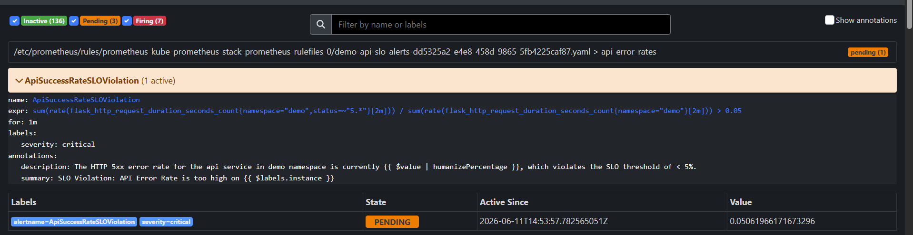
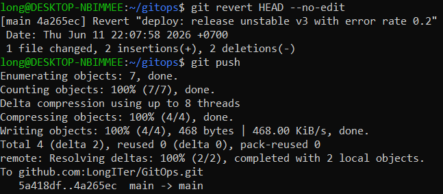
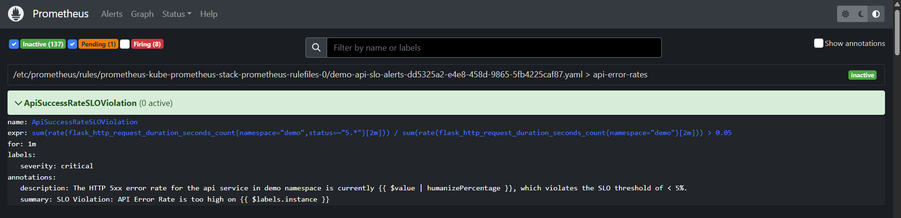
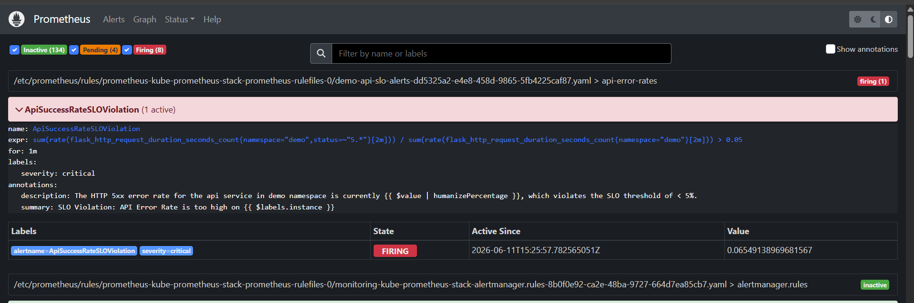
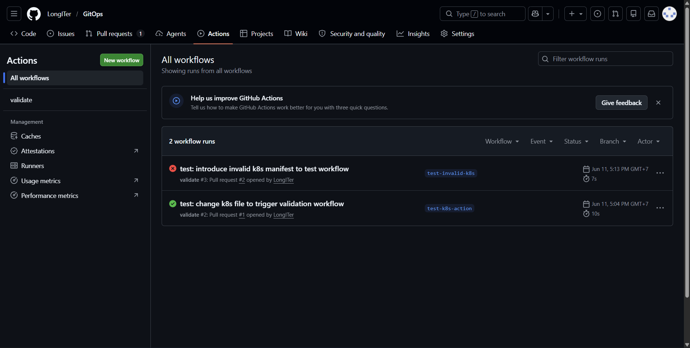

# GitOps

## Minh chứng (Evident)

Phần này chứng minh repo đáp ứng đúng yêu cầu đề bài: đưa bản mới `api` ra an toàn và tự bảo vệ. Phải đủ cả 4 tiêu chí bên dưới.

- **1. Thay đổi qua Git (ArgoCD sync) — reproduce từ Git, không drift**
	- Mọi thay đổi cấu hình/rollout nằm trong repo và được apply bởi ArgoCD.
	- Ví dụ file rollout/manifest và AnalysisTemplate có trong repo (xem thư mục `argocd/` và `k8s-api/`).

- **2. Rollback nhanh bằng Git**
	- Yêu cầu: có thể rollback bằng `git revert` trong < 5 phút và ArgoCD sẽ sync trở lại phiên bản trước.

- **3. Đo lường + cảnh báo (SLO + alert → email cá nhân)**
	- Có SLO/alert định nghĩa rõ ràng; khi chất lượng tụt, alert sẽ fire và gửi về email cá nhân (ảnh minh họa bên dưới).

- **4. Canary tự động: pause/đánh giá → auto-abort + rollback nếu lỗi**
	- Sử dụng `AnalysisTemplate` để pause và kiểm tra các chỉ số; nếu vi phạm ngưỡng thì tự abort và quay về bản cũ (quan trọng nhất).

Nộp: repo chứa `Rollout` + `AnalysisTemplate` + SLO/alert — tất cả qua Git. README này mô tả query & ngưỡng, đồng thời kèm ảnh/chứng minh về canary auto-abort + rollback.

Ảnh minh chứng (mô tả):

- **alert.png** — cảnh báo đã fire trên Grafana/Prometheus.

- **alert1.png** — chi tiết alert / rule (query, ngưỡng) trong Grafana.

- **alert2.png** — email/notification nhận được (ví dụ gửi về email cá nhân).

- **alert3.png** — Argo Rollout trạng thái (pause/abort/rollback) hoặc logs liên quan.

- **Test_CI.png** — bằng chứng CI/CD (build/test) hoặc proof-of-deployment.

